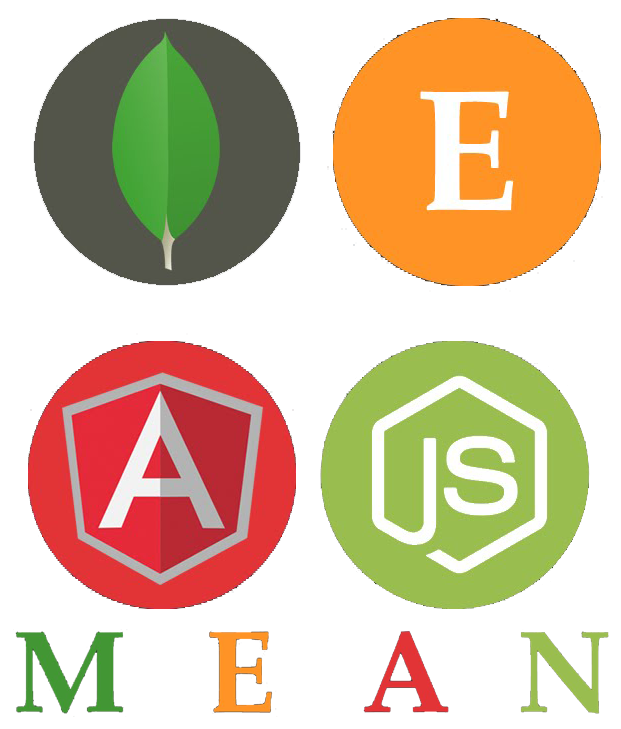
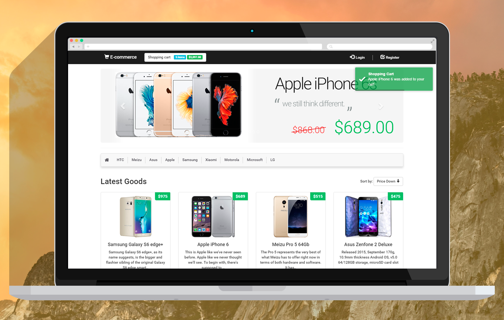
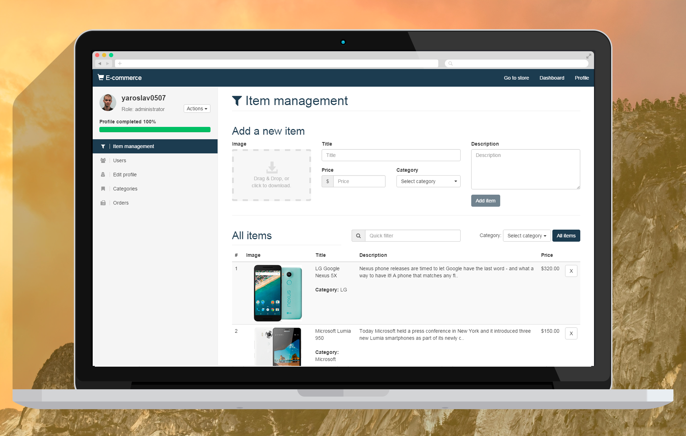
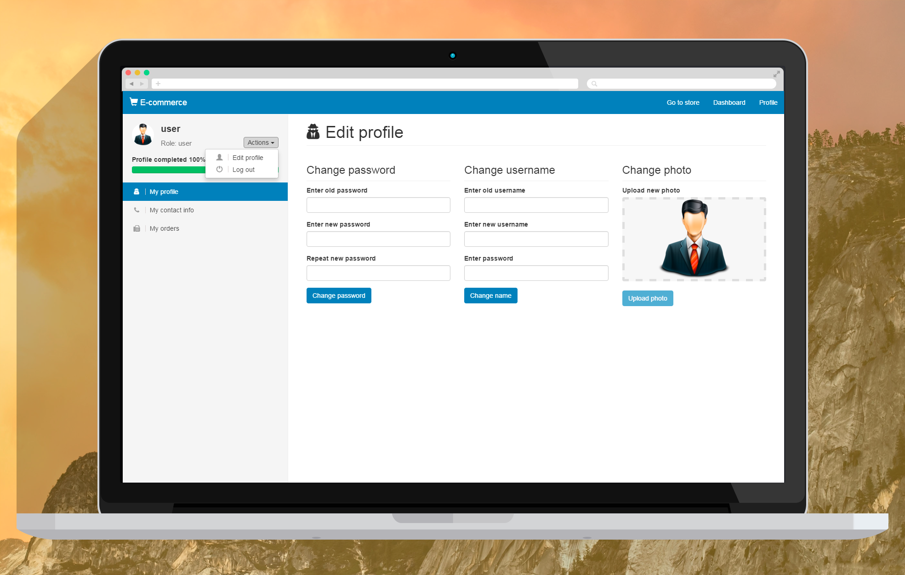

# MEAN Stack E-commerce

Demo: [http://styleworks.herokuapp.com](http://styleworks.herokuapp.com/)

## Stack of technologies


* [Mongo DB](https://www.mongodb.org/);
* [Express JS](http://expressjs.com/);
* [Angular JS](https://angularjs.org/);
* [Node JS](https://nodejs.org/);

## Running Locally

Make sure you have [Node.js](http://nodejs.org/) installed.

```sh
$ git clone git@github.com:yaroslav0507/FullStackJS.git # or clone your own fork
$ cd pet
$ npm install
$ npm start
```

Your app should now be running on [localhost:4000](http://localhost:4000/).

## Developing mode

Open a separate terminal or shell
```
$ gulp serve
```
Now app will start in google chrome on the [localhost:7000](http://localhost:7000/).
All changes in the code will be immediately reflected in your browser by [browser-sync](http://browsersync.io/)

## Interface
Store


Admin Dashboard


User Dashboard

